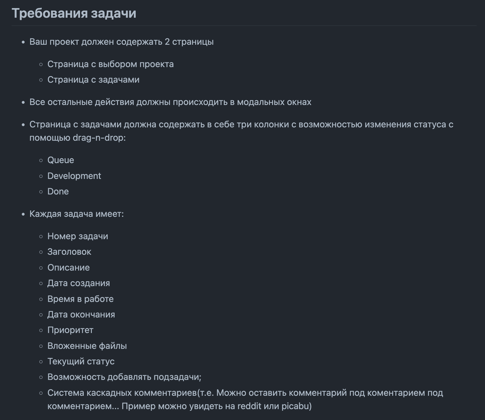
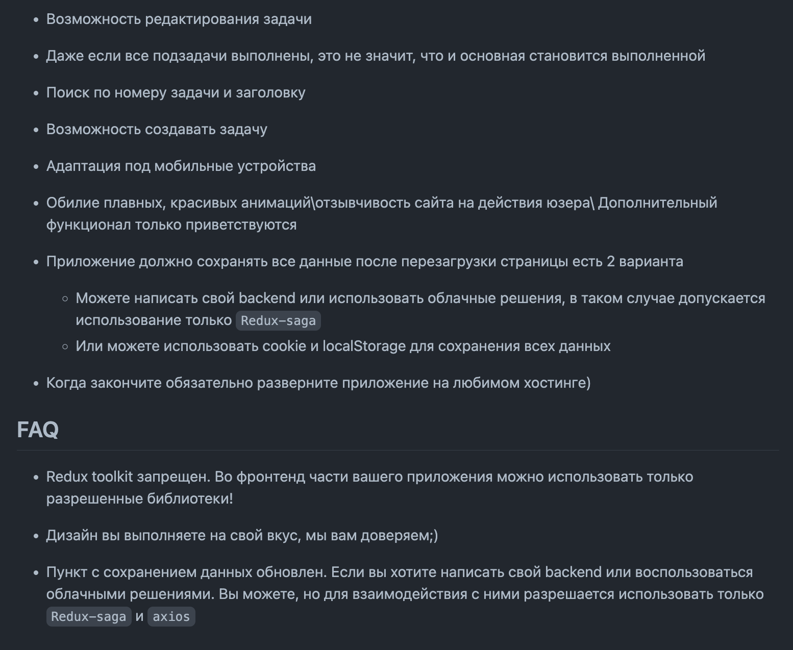

# Test assignment for "UpTrader" company.

## Details:
- Time spent by me: 2 days
- It was my first time working with drag-n-drop, and I decided to do it with vanilla JS without using any additional frameworks. It made the task more interesting to complete.
- I allocated little time for styling the application.
- Not all items from the specification were completed.

## Website preview:

<b>Show screenshots</b>

## Task Description:

<b>Show screenshots</b>

## Deploy
Website link: [Test task "UpTrader"](https://up-trader-test-task.vercel.app/)
